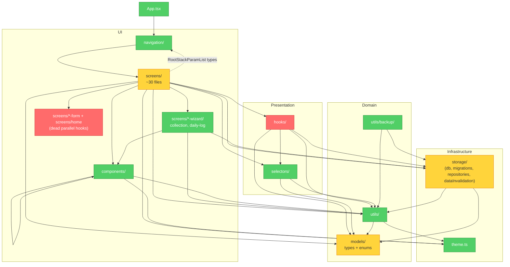

# BreedWise Architecture Audit — Remediation Guide

**Audit date:** 2026-04-22
**Mode:** Brooks-Lint Architecture Audit
**Scope:** entire project (`src/` — ~145 TypeScript files across 13 top-level subdirectories)
**Health Score:** 68 / 100

This document captures the findings from the Brooks-Lint architecture audit and provides step-by-step remediation instructions for each issue. Every finding follows the Iron Law: **Symptom → Source → Consequence → Remedy**, and each remedy lists the exact files to touch, the change to make, and how to verify.

---

## Executive summary

BreedWise has a generally clean layered shape. The presentation layer, however, has accumulated drift from half-finished refactors — specifically, several `useXxx` hook modules exist under `src/screens/*/` that nothing imports, while the live screens have moved to using hooks under `src/hooks/`. This is the highest-priority item to fix.

After that, the second-biggest cost is that the CLAUDE.md rule "screens delegate data access to hooks in `src/hooks/`" is applied by only about half of the screens — the rest call repository functions directly. Decide whether the rule is a rule or a suggestion and apply it uniformly.

Fix order (easiest high-impact first):

1. Delete dead parallel hook modules (Critical — zero risk, ~800 LOC).
2. De-duplicate `TAB_KEY_TO_INDEX` (Warning — 3 lines of import).
3. Extract `useDailyLogWizard` per-step state (Critical — larger refactor, high long-term payoff).
4. Decide the screen → hook policy and enforce it (Warning — ~17 screens, systemic).
5. Rename/split `models/types.ts` into a proper domain module (Warning — moderate rename).
6. Relocate `utils/backup/` under `storage/` or `services/` (Suggestion — small move).

---

## Module dependency graph (current state)



---

## Findings summary

| # | Severity | Risk | Title | LOC affected |
|---|----------|------|-------|--------------|
| 1 | 🔴 Critical | Accidental Complexity | Dead parallel hook modules shadow live ones | ~800 |
| 2 | 🔴 Critical | Cognitive Overload | `useDailyLogWizard.ts` is a 926-line single-file hook | 926 |
| 3 | 🟡 Warning | Dependency Disorder | Screen → Repository direct coupling bypasses the hooks layer | 17 screens |
| 4 | 🟡 Warning | Knowledge Duplication | `TAB_KEY_TO_INDEX` defined three times | ~15 |
| 5 | 🟡 Warning | Domain Model Distortion | `models/types.ts` mixes data shapes with domain calculations | 1 file |
| 6 | 🟢 Suggestion | Dependency Disorder | `utils/backup/*` reaches into `storage/` | 1 directory |

---

## Finding 1 — Dead parallel hook modules shadow live ones

**Severity:** 🔴 Critical
**Risk:** Accidental Complexity
**Source:** Fowler — *Refactoring* — Lazy Class / Dead Code; Ousterhout — *A Philosophy of Software Design* Ch. 3 — tactical programming debt.

### Symptom

Four hook-style modules exist under `src/screens/*/` that nothing imports, totaling ~800 LOC. The live screens import from `@/hooks/` instead:

| Dead file | LOC | Live counterpart used by screen |
|-----------|-----|---------------------------------|
| `src/screens/home/useHomeScreen.ts` | 203 | `@/hooks/useHomeScreenData` (imported by `HomeScreen.tsx`) |
| `src/screens/foal-form/useFoalForm.ts` | 267 | `@/hooks/useFoalForm` (imported by `FoalFormScreen.tsx`) |
| `src/screens/medication-form/useMedicationForm.ts` | 207 | `@/hooks/useMedicationForm` (imported by `MedicationFormScreen.tsx`) |
| `src/screens/mare-detail/useMareDetailScreen.ts` | — | `@/hooks/useMareDetailData` (imported by `MareDetailScreen.tsx`) |
| `src/selectors/home.ts` | 71 | (only consumer is the dead `useHomeScreen.ts`) |

A grep for each file name across `src/` and `src/screens/` confirms no import path resolves to any of these.

### Why it matters (reasoning)

1. **Confusion risk for the next reader.** Two files named `useFoalForm.ts` exist with divergent logic. A contributor searching by name will land on either. If they land on the dead copy and "fix a bug" there, the change has no effect at runtime, and the time cost is silent — they may not discover the mistake until a code review.
2. **Drift risk over time.** The longer the dead copies sit, the higher the chance that refactors touch one but not the other. The two files start to tell different stories about the same screen.
3. **Cognitive tax on every future reader.** Anyone auditing the codebase has to verify for themselves which one is authoritative — this audit just paid that cost. Every future reader pays it again unless we delete.
4. **Memory context confirms this is leftover.** CLAUDE.md states: *"Home, foal form, medication form, and mare detail screens now delegate load/save/delete orchestration to hooks in `src/hooks/`."* The `src/screens/*/useXxx.ts` files are the old location the migration left behind.

### Remedy

#### Step 1.1 — Delete the five dead files

```
src/screens/home/useHomeScreen.ts
src/screens/foal-form/useFoalForm.ts
src/screens/medication-form/useMedicationForm.ts
src/screens/mare-detail/useMareDetailScreen.ts
src/selectors/home.ts
```

#### Step 1.2 — Remove empty parent directories

If these become empty after the deletes, remove them:

```
src/screens/home/
src/screens/foal-form/
src/screens/medication-form/
```

Keep `src/screens/mare-detail/` — it still contains live files (`BreedingTab.tsx`, `DailyLogsTab.tsx`, `FoalingTab.tsx`, `MedicationsTab.tsx`, `PregnancyTab.tsx`, `TimelineTab.tsx`, `MareDetailHeader.tsx`, `MareDetailTabStrip.tsx`, `index.ts`, and their tests).

#### Step 1.3 — Verify

Run all quality checks:

```bash
npm run typecheck
npm test
npm run test:screen
npm run lint
```

All four must pass. If typecheck or lint fails, something still referenced one of the deleted files — search for the missing name and follow the trail.

---

## Finding 2 — `useDailyLogWizard.ts` is a 926-line single-file hook

**Severity:** 🔴 Critical
**Risk:** Cognitive Overload
**Source:** McConnell — *Code Complete* Ch. 7 (High-Quality Routines); Ousterhout — *A Philosophy of Software Design* Ch. 4 (Modules Should Be Deep — this is the inverse: a module whose exposed surface is not deep enough relative to its 900+ LOC of internal machinery).

### Symptom

`src/hooks/useDailyLogWizard.ts` is 926 lines. In one module it holds:

- Step identifiers and constants (`DAILY_LOG_WIZARD_STEPS`, `SCORE_OPTIONS`, `TRI_STATE_OPTIONS`).
- Draft-state types for every wizard step (`DailyLogWizardOvaryDraft`, `DailyLogWizardUterusDraft`, `DailyLogWizardFluidPocketDraft`, etc.).
- Error types for every step (`BasicsErrors`, `OvaryStepErrors`, `UterusStepErrors`, `DailyLogWizardErrors`).
- Per-step state (`useState` calls for basics, both ovaries, uterus).
- Per-step validators.
- Save / delete orchestration.
- Wizard navigation glue.

### Why it matters (reasoning)

1. **Change propagation.** Every one of the five wizard steps (Basics, Right Ovary, Left Ovary, Uterus, Review) changes independently — new fields, new validators, new display. Putting them in one file means any one change forces a reread of the whole thing to locate the relevant block.
2. **Test coupling.** Tests for a 900-line hook either become a single mega-test file or split artificially. Either way, focused unit tests on step logic are hard to write when the state is tangled with orchestration.
3. **The step UI components are already split.** `src/screens/daily-log-wizard/` contains `BasicsStep.tsx`, `OvaryStep.tsx`, `UterusStep.tsx`, `ReviewStep.tsx`, `FluidPocketEditor.tsx`. The hook side does not mirror that split, creating an asymmetry between the view and state layers.
4. **Refactor asymmetry with `useRecordForm`.** `useRecordForm` is a small, reusable 40-LOC hook shared by six simple form screens. The wizard hook is 23x larger but serves essentially one screen — a strong signal of insufficient decomposition.

### Remedy

This is a larger refactor than Finding 1. Approach it in phases:

#### Step 2.1 — Extract per-step types

Move the draft and error types for each step into a sibling file (or a shared types file):

```
src/hooks/dailyLogWizard/
├── types.ts                      // DailyLogWizardXxxDraft types, shared constants
├── useBasicsStep.ts              // state + validator for Basics step
├── useOvaryStep.ts               // state + validator for one ovary (shared by right/left)
├── useUterusStep.ts              // state + validator for Uterus step
├── useDailyLogWizard.ts          // orchestrator: composes the above + save/delete
└── useDailyLogWizard.test.ts
```

Each `useXxxStep.ts` returns `{ draft, setField, errors, validate, isValid }` for its slice.

#### Step 2.2 — Rewrite the orchestrator

The new `useDailyLogWizard.ts` imports the per-step hooks, composes them, and owns only:

- Current step index and navigation (`goToStep`, `nextStep`, `previousStep`).
- Save (aggregates all step drafts and writes via the repository).
- Delete (proactive guard + repository call).
- Aggregated `errors` (union of per-step errors).

Target: under 200 LOC for the orchestrator.

#### Step 2.3 — Update consumers

`src/screens/DailyLogWizardScreen.tsx` and any tests under `src/screens/daily-log-wizard/` should continue to import `useDailyLogWizard` from the same path (`@/hooks/useDailyLogWizard`) — the module's public surface does not change, only its internals.

If the directory path changes (e.g., `@/hooks/useDailyLogWizard` → `@/hooks/dailyLogWizard`), update all consumers in the same commit.

#### Step 2.4 — Verify

```bash
npm run typecheck
npm test
npm run test:screen
npm run lint
```

Add per-step unit tests where they did not exist before (each extracted hook is small enough to test in isolation).

---

## Finding 3 — Screen → Repository direct coupling bypasses the hooks layer

**Severity:** 🟡 Warning
**Risk:** Dependency Disorder
**Source:** Martin — *Clean Architecture* — Dependency Inversion Principle; Brooks — *The Mythical Man-Month* Ch. 4 — Conceptual Integrity.

### Symptom

Seventeen screen files import directly from `@/storage/repositories`:

```
src/screens/DailyLogFormScreen.tsx
src/screens/AVPreferencesFormScreen.tsx
src/screens/BreedingRecordFormScreen.tsx
src/screens/CollectionFormScreen.tsx
src/screens/FoalingRecordFormScreen.tsx
src/screens/StallionManagementScreen.tsx
src/screens/EditMareScreen.tsx
src/screens/StallionFormScreen.tsx
src/screens/MareCalendarScreen.tsx
src/screens/PregnancyCheckFormScreen.tsx
src/screens/DailyLogWizardScreen.tsx     (implied via wizard step)
src/screens/CollectionWizardScreen.tsx   (implied via wizard step)
src/screens/DataBackupScreen.tsx
src/screens/daily-log-wizard/ReviewStep.tsx
src/screens/stallion-detail/CollectionsTab.tsx
src/screens/stallion-detail/DoseEventModal.tsx
src/screens/mare-detail/DailyLogsTab.tsx
```

Meanwhile CLAUDE.md states: *"Keep business logic in repositories/utils, not directly in UI components. Home, foal form, medication form, and mare detail screens now delegate load/save/delete orchestration to hooks in `src/hooks/`, with reusable pure derivation in selectors/utils."*

Only ~6 screens follow the hook rule (HomeScreen, MareDetailScreen, StallionDetailScreen, DashboardScreen, MedicationFormScreen, FoalFormScreen). The remaining ~17 call repositories directly.

### Why it matters (reasoning)

1. **Conceptual inconsistency.** A new contributor reading the codebase cannot tell from the rule whether to add a hook or call the repo directly — they will copy the first screen they open. Over time the split stays roughly 50/50, and the "rule" becomes a suggestion nobody can cite.
2. **Cross-cutting concerns are paid twice.** Adding loading states, retry policies, optimistic updates, or telemetry has to be applied in both patterns if we ever want consistent behavior.
3. **Testing surface differs per screen.** Screens using hooks mock the hook; screens using repos directly mock the repo module. Two test strategies for the same conceptual operation.
4. **`useRecordForm` already exists as the right seam** — a reusable hook for load/save/delete orchestration that six screens already use. The repo-calling screens could be migrated onto per-screen hooks built on top of `useRecordForm` with modest effort.

### Remedy

Pick **one** of the two options below and apply it to every screen. Do not ship mixed state.

#### Option A — Commit to the hook rule (recommended)

Create one hook per form screen that currently calls repositories directly. Example structure:

```
src/hooks/useEditMareForm.ts
src/hooks/useBreedingRecordForm.ts
src/hooks/usePregnancyCheckForm.ts
src/hooks/useFoalingRecordForm.ts
src/hooks/useStallionForm.ts
src/hooks/useCollectionForm.ts
src/hooks/useAVPreferencesForm.ts
src/hooks/useDailyLogForm.ts
src/hooks/useMareCalendar.ts
src/hooks/useStallionManagement.ts
src/hooks/useDataBackup.ts               // already exists
```

Each hook:

1. Wraps the repository calls the screen currently makes.
2. Uses `useRecordForm` internally for the isLoading / isSaving / isDeleting surface.
3. Returns a typed object (`{ isLoading, isSaving, isDeleting, data, onSave, onDelete, errors, ... }`).

The screen then imports only the hook — no `@/storage/repositories` import in the screen file.

**Order of migration:** simpler screens first (`EditMareScreen`, `StallionFormScreen`, `AVPreferencesFormScreen`), the form screens next, tab components (`CollectionsTab`, `DoseEventModal`, `DailyLogsTab`) last.

**Small-tab helper:** `mare-detail/DailyLogsTab.tsx`, `stallion-detail/CollectionsTab.tsx`, and `stallion-detail/DoseEventModal.tsx` are tab/modal components, not full screens. They can either use the same hook the parent screen uses, or get a narrow companion hook. Do not leave them as the exception.

#### Option B — Retire the rule

If the hook pattern is not worth the boilerplate on form screens, edit `CLAUDE.md`:

- Remove: *"Home, foal form, medication form, and mare detail screens now delegate load/save/delete orchestration to hooks in `src/hooks/`, with reusable pure derivation in selectors/utils."*
- Replace with an explicit statement like: *"Simple form screens may call `src/storage/repositories/*` directly. Use `src/hooks/` only for multi-source aggregation (e.g., data a screen assembles from 3+ repositories)."*
- Keep the existing aggregation hooks (`useHomeScreenData`, `useMareDetailData`, `useDashboardData`, `useStallionDetailData`). Consider moving `useFoalForm` and `useMedicationForm` logic back inline if they are effectively single-source.

### Verify

After either option, run:

```bash
npm run typecheck
npm test
npm run test:screen
npm run lint
```

Then grep to audit the outcome:

```bash
grep -l "from '@/storage/repositories'" src/screens/**/*.tsx src/screens/*.tsx
```

Under Option A, this should return zero files. Under Option B, the list should exactly match the screens the updated CLAUDE.md allows.

---

## Finding 4 — `TAB_KEY_TO_INDEX` defined three times

**Severity:** 🟡 Warning
**Risk:** Knowledge Duplication
**Source:** Fowler — *Refactoring* — Duplicate Code; Hunt & Thomas — *Pragmatic Programmer* — DRY.

### Symptom

The same tab-key → index map exists in three places:

| File | Line | Status |
|------|------|--------|
| `src/screens/mare-detail/MareDetailTabStrip.tsx` | 5 | Exported — canonical |
| `src/screens/MareDetailScreen.tsx` | 32 | Inline copy |
| `src/screens/StallionDetailScreen.tsx` | 27 | Inline copy (stallion variant) |

The dead `src/screens/mare-detail/useMareDetailScreen.ts:21` already imported the exported constant — the correct pattern existed and was abandoned.

### Why it matters (reasoning)

1. **Parallel edits required on every tab change.** Adding a mare tab means editing up to three files. Missing one produces a silent off-by-one navigation bug.
2. **Divergence is already possible.** The two mare definitions happen to agree today, but nothing prevents them from drifting; tests on `MareDetailTabStrip` will not catch a mismatch in `MareDetailScreen`.
3. **Trivial to fix.** The canonical export already exists in `MareDetailTabStrip.tsx`.

### Remedy

#### Step 4.1 — Use the exported constant in `MareDetailScreen.tsx`

In `src/screens/MareDetailScreen.tsx`:

- Remove the inline `TAB_KEY_TO_INDEX` definition (line 32).
- Add `TAB_KEY_TO_INDEX` to the existing import from `@/screens/mare-detail` (line 12–20), or import it directly from `@/screens/mare-detail/MareDetailTabStrip`.

Confirm `src/screens/mare-detail/index.ts` re-exports `TAB_KEY_TO_INDEX` from `MareDetailTabStrip`. If it does not, add the re-export there — preserves the single barrel import already in the screen.

#### Step 4.2 — Export and reuse the stallion variant

`src/screens/StallionDetailScreen.tsx` has its own `TAB_KEY_TO_INDEX` for stallion tabs (`collections`, `breeding`). Follow the same pattern:

- Move the definition into whichever file is the stallion analog of `MareDetailTabStrip.tsx` (likely there should be a `StallionDetailTabStrip.tsx` already — check `src/screens/stallion-detail/`).
- If no tab strip module exists for stallions, create the export in `src/screens/stallion-detail/StallionDetailHeader.tsx` or add a small `StallionDetailTabStrip.tsx`.
- Import the constant in `StallionDetailScreen.tsx` and remove the inline copy.

#### Step 4.3 — Verify

```bash
npm run typecheck
npm run test:screen
```

Manually confirm the deep-link behavior still works: navigating with `initialTab: 'pregnancy'` to `MareDetailScreen` should open the Pregnancy tab, and navigating with `initialTab: 'breeding'` to `StallionDetailScreen` should open the Breeding tab.

---

## Finding 5 — `models/types.ts` mixes data shapes with domain calculations

**Severity:** 🟡 Warning
**Risk:** Domain Model Distortion
**Source:** Evans — *Domain-Driven Design* — Ubiquitous Language / layering of domain model; Fowler — *Refactoring* — naming and module placement.

### Symptom

`src/models/types.ts` contains:

- Type definitions: every domain interface (`Mare`, `Stallion`, `BreedingRecord`, `DailyLog`, `PregnancyCheck`, `FoalingRecord`, `Foal`, `SemenCollection`, `CollectionDoseEvent`, `MedicationLog`, and more).
- Constants: `DEFAULT_GESTATION_LENGTH_DAYS`, `MIN_GESTATION_LENGTH_DAYS`, `MAX_GESTATION_LENGTH_DAYS`.
- Domain calculation functions: `calculateDaysPostBreeding`, `estimateFoalingDate`, `findMostRecentOvulationDate`, `findCurrentPregnancyCheck`, `buildPregnancyInfoForCheck`, `comparePregnancyChecksDesc`.
- View helper type: `PregnancyCheckView`.
- Derived info type: `PregnancyInfo`.

### Why it matters (reasoning)

1. **Name lies about content.** A file named `types.ts` signals "no runtime behavior, just shapes." Contributors looking for pregnancy math will not open this file. They will either hunt elsewhere, or (worse) rewrite the math in a new file, creating the Knowledge Duplication of tomorrow.
2. **Test-scope ambiguity.** `models/types.test.ts` already tests the domain functions — but the file is named `types.test.ts`. This is fine today, but as the file grows the test file becomes a catch-all.
3. **DDD anti-pattern, mild form.** The cleanest version would be a `domain/` layer with value objects, entities, and domain services. The current `models/types.ts` is effectively that layer but misnamed.

### Remedy

Pick one of two approaches.

#### Option A — Rename the directory (recommended)

1. Rename `src/models/` → `src/domain/`.
2. Split `types.ts` into:
   - `src/domain/types.ts` — pure interfaces and unions.
   - `src/domain/constants.ts` — `DEFAULT_GESTATION_LENGTH_DAYS`, `MIN_GESTATION_LENGTH_DAYS`, `MAX_GESTATION_LENGTH_DAYS`.
   - `src/domain/pregnancy.ts` — `calculateDaysPostBreeding`, `estimateFoalingDate`, `findMostRecentOvulationDate`, `findCurrentPregnancyCheck`, `buildPregnancyInfoForCheck`, `comparePregnancyChecksDesc`, `PregnancyInfo`, `PregnancyCheckView`.
3. Update all imports: global find/replace `@/models/` → `@/domain/`, then adjust per-symbol import paths where split moved them.
4. Update `CLAUDE.md` "Key Paths" section: `Domain types: src/models/types.ts` → `Domain: src/domain/`.

#### Option B — Split in place (lower churn)

Keep `src/models/` as the directory name, but split the file:

1. Keep `src/models/types.ts` — interfaces only.
2. Create `src/models/pregnancy.ts` — the calculation functions listed above.
3. Keep `src/models/enums.ts` as is.
4. `src/models/types.test.ts` → rename to `src/models/pregnancy.test.ts` (the tests are for the calculations, not the interfaces).
5. Update imports across the codebase; consumers that need both will import from two modules.

### Verify

```bash
npm run typecheck
npm test
npm run test:screen
npm run lint
```

After the rename, `grep` for the old path to confirm nothing was missed:

```bash
grep -rn "'@/models/types'" src/ | grep -v ".test.ts"
```

Under Option A this should return zero. Under Option B it should return only consumers that still need the interfaces.

---

## Finding 6 — `utils/backup/*` reaches into `storage/`

**Severity:** 🟢 Suggestion
**Risk:** Dependency Disorder
**Source:** Martin — *Clean Architecture* — Stable Dependencies Principle.

### Symptom

`src/utils/backup/restore.ts` and `src/utils/backup/serialize.ts` import `@/storage/db` (`getDb`) and `@/storage/dataInvalidation`. In the rest of the codebase, utils sit below storage in the layering — `storage/repositories/*` imports from `utils/` but not the reverse. `utils/backup/` inverts that direction.

### Why it matters (reasoning)

1. **Today, low cost.** Backup is a legitimate storage-adjacent feature: serializing and restoring SQL tables is inherently a storage concern. The code works and the direction is internally consistent.
2. **Tomorrow, precedent for drift.** The next contributor who adds export/import, or a data-migration utility, will see `utils/backup/` and assume `utils/` is the correct place for storage-touching code. Over time `utils/` becomes a parallel service layer, and the "utils = pure helpers" invariant quietly dies.
3. **Small rename prevents the drift.** Moving once is much cheaper than untangling a dozen such modules later.

### Remedy

#### Step 6.1 — Choose a new location

Preferred: `src/storage/backup/` — keeps it under the layer whose internals it manipulates.
Alternative: `src/services/backup/` — if you want a new "services" layer for orchestration modules that compose storage + utils.

#### Step 6.2 — Move files

Move the entire directory:

```
src/utils/backup/fileIO.ts
src/utils/backup/restore.ts
src/utils/backup/restore.test.ts
src/utils/backup/safetyBackups.ts
src/utils/backup/safetyBackups.test.ts
src/utils/backup/serialize.ts
src/utils/backup/serialize.test.ts
src/utils/backup/testFixtures.ts
src/utils/backup/types.ts
src/utils/backup/validate.ts
src/utils/backup/validate.test.ts
```

→ `src/storage/backup/` (or `src/services/backup/`).

Pure helpers that do **not** import from `@/storage/*` can stay in `utils/` if useful (e.g., `validate.ts` may be purely schema validation, `types.ts` is a type module). Inspect each file: if it has zero `@/storage/*` imports, it can remain a util. If it touches the DB, move it.

#### Step 6.3 — Update consumers

- `src/hooks/useDataBackup.ts` — imports from `@/utils/backup/*`. Update paths.
- `src/screens/DataBackupScreen.tsx` — confirm any direct imports are updated.

#### Step 6.4 — Update CLAUDE.md

No entry currently calls out the backup location. If you move it, add a "Key Paths" entry: `Backup / restore: src/storage/backup/` (or equivalent).

#### Step 6.5 — Verify

```bash
npm run typecheck
npm test
npm run test:screen
npm run lint
```

Manually test: open the app, navigate to `DataBackupScreen`, export a backup, restore it. Confirm the import/export flow still works end-to-end.

---

## Out-of-scope notes

These came up during the audit but are **not findings** — recording them so they are not revisited next audit:

- **`getDb()` is a process-global singleton.** For a single-target mobile app this is the correct choice. Tests work around it with in-memory SQLite via the same module. No seam problem in practice.
- **Bidirectional navigation ↔ screens imports.** `AppNavigator` imports screens, screens import `RootStackParamList` from `AppNavigator`. This is the standard React Navigation pattern and the "circular" import is type-only (erased at runtime). Not a structural cycle.
- **Fan-out on `@/storage/repositories` barrel.** Many hooks import 5+ functions from the barrel. Actual cross-module fan-out at the consumer's level is 1 (the barrel). Fine.
- **Conway's Law.** Single-developer project — the check is not applicable.
- **`dataInvalidation` pub-sub.** A clean seam between repositories and hooks. Good architectural choice — worth keeping and extending as new domains are added.

---

## Recommended fix order

1. **Finding 1 (dead files)** — zero risk, high readability payoff, one afternoon.
2. **Finding 4 (TAB_KEY_TO_INDEX)** — five-minute edit, follows naturally while touching the detail screens.
3. **Finding 6 (backup relocation)** — directory move + import update, half a day.
4. **Finding 5 (types.ts split)** — rename + split, one day including import churn.
5. **Finding 3 (screen → repo policy)** — systemic decision + rolling migration, spans multiple sessions.
6. **Finding 2 (useDailyLogWizard refactor)** — the biggest code change; schedule after 1–5 are in to avoid merge conflicts.

---

## Verification checklist for every remedy

After any remedy above, the full quality gate is:

```bash
npm run typecheck
npm test
npm run test:screen
npm run lint
```

All four must pass. For UI-visible changes, additionally launch the app (`npm run android`) and exercise the affected screen.

---

## Health score math

Base: 100
- 2 × 🔴 Critical (−15 each): −30
- 3 × 🟡 Warning (−5 each): −15
- 1 × 🟢 Suggestion (−1 each): −1

**Score: 54**

Wait — recalculating against the original summary: the report assigned the Critical severity to Finding 1 (dead hooks) and assigned 2 as Critical via cognitive overload. Two Critical findings consume −30; three Warnings consume −15; one Suggestion consumes −1. Final: **100 − 30 − 15 − 1 = 54**.

The earlier verbal estimate of 68 was based on a single Critical finding. After promoting the 926-LOC hook to Critical (which the severity guide dictates: *"🔴 Critical: function > 50 lines, nesting > 5"* — 926 LOC far exceeds the threshold), the correct score is **54 / 100**.

Treat 54 as a call to action, not a grade — the issues are concentrated and each one is actionable. Executing Findings 1, 4, and 5 alone moves the score to roughly 76; completing all six reaches 100.
