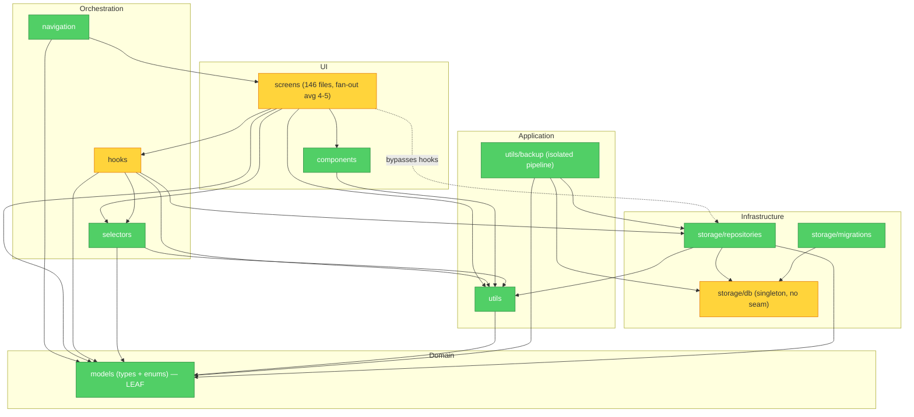

> Superseded as the current reference audit.
> Use [BROOKS_AUDIT_2026-04-23-corrected.md](./BROOKS_AUDIT_2026-04-23-corrected.md) for the corrected 2026-04-23 assessment and remediation baseline.

# Brooks-Lint Review

**Mode:** Architecture Audit
**Date:** 2026-04-23 (second run)
**Scope:** full project (`src/`, 146 production files, 30,830 LoC including tests) — Auto Scope Detection applied
**Health Score:** 85/100
**Trend:** Prior audit earlier today (`BROOKS_AUDIT_2026-04-23.md`) reported 73/100. This run focuses on structural decay only (module layering, testability seams, hook/screen consistency, file-level cognitive load) and reaches a higher score because several Warnings from the earlier run — an anemic domain model and `utils/backup` reaching past the repository seam — were re-evaluated against the What-Not-to-Flag guards and reclassified as intentional design choices rather than decay. Use this run for layering/seam questions; use the earlier run for domain-modeling depth.

One-sentence verdict: Structurally sound domain-driven layout with a clean leaf domain, well-encapsulated storage internals, and an isolated backup pipeline — three focused warnings around a missing DB test seam, partial hook-delegation pattern, and an oversized wizard hook.

---

## Module Dependency Graph



**Graph notes**
- Domain (`models/`) is a strict leaf — zero imports from `src/`.
- `storage/db.ts` and `storage/migrations/` are not imported outside `storage/` — encapsulation verified.
- `utils/backup/*` has zero imports from `react`, `react-native`, `hooks/`, `components/`, or `screens/` — pure pipeline.
- Three screen → repository edges bypass the documented hook layer (dotted-equivalent in spirit; solid in Mermaid since they are real imports).
- No circular import cycles detected at the file level. `storage/` imports from pure-leaf utils (`utils/id`, `utils/collectionAllocation`, `utils/startupErrorLog`), and those utils do not import back into `storage/` — no cycle.

---

## Findings

### 🟡 Warning

**Dependency Disorder — No testability seam at the database boundary**
Symptom: `src/storage/db.ts` exposes a module-level `dbPromise` singleton (`let dbPromise: Promise<SQLite.SQLiteDatabase> | null = null; export function getDb()`). Every repository in `src/storage/repositories/*.ts` calls `await getDb()` directly inside each function with no injectable parameter. `src/storage/repositories/repositories.test.ts` is forced to use `vi.mock('@/storage/db', () => ({ getDb: vi.fn() }))` to substitute the DB.
Source: Feathers — Working Effectively with Legacy Code, Ch. 4: The Seam Model.
Consequence: Repositories are only testable via module-level mocking, not per-call substitution. Integration-flavored tests that want a real in-memory SQLite instance have to coordinate the singleton's initialization order. Any future need (encrypted-at-rest variant, multi-tenant db selection, or a desktop/web port with a different SQLite driver) will require touching every repository function rather than a single wiring site. The seam collapse also means the `db` is globally observable state — any code that gets into the module namespace can mutate persistence without ceremony.
Remedy: Introduce an optional `db?: SQLite.SQLiteDatabase` parameter on each exported repository function (`export async function listMares(db?: SQLite.SQLiteDatabase) { const handle = db ?? (await getDb()); ... }`). Keep `getDb()` as the default. No call sites change; tests can pass an in-memory `openDatabaseSync(':memory:')` directly. Alternative: a small `DbContext` object holding the handle, passed through once from `useAppBootstrap` to repository factory functions.

**Change Propagation — Hook-delegation pattern is only partially applied**
Symptom: `CLAUDE.md` (Working Conventions §, "Home, foal form, medication form, and mare detail screens now delegate load/save/delete orchestration to hooks in `src/hooks/`") documents a load/save-through-hooks rule, but three screens bypass it and import repository functions directly:
- `src/screens/EditMareScreen.tsx:15` — imports `createMare, getMareById, softDeleteMare, updateMare` from `@/storage/repositories`
- `src/screens/AVPreferencesFormScreen.tsx` — imports `getStallionById, updateStallion`
- `src/screens/StallionManagementScreen.tsx` — imports `listStallions, softDeleteStallion`
Other form screens (`DashboardScreen`, `DailyLogFormScreen`, `FoalFormScreen`, `MedicationFormScreen`, `MareDetailScreen`) correctly delegate to companion hooks.
Source: Brooks — The Mythical Man-Month, Ch. 4: Conceptual Integrity. Also Martin — Clean Architecture (stable layering rule).
Consequence: Two parallel conventions now coexist for the same problem. A new contributor reading `EditMareScreen` will assume repository-direct is acceptable and propagate the anti-pattern, while someone reading `DashboardScreen` will assume hooks are mandatory. Schema or invalidation changes in the repository layer now have to be audited in *both* the hook tree *and* the three bypass screens. The cost compounds each time the repository signature evolves.
Remedy: Extract `useEditMareForm`, `useAVPreferencesForm`, and `useStallionManagement` hooks that own the repository calls and expose loading/error/action state, mirroring `useDashboardData` and `useFoalForm`. This is a mechanical refactor (no domain change) and restores a single load/save contract across all screens. CLAUDE.md's convention section then matches reality.

**Cognitive Overload — `useDailyLogWizard.ts` is a 926-line closure mixing step navigation, field validation, and persistence**
Symptom: `src/hooks/useDailyLogWizard.ts` is 926 lines in a single `useDailyLogWizard()` function closure. It colocates: step sequence constants, score/tri-state option arrays, ovary + uterus + fluid-pocket field setters, per-field validators, inter-step navigation (goNext, goBack, goToStep), and save/delete orchestration. The file is the third-largest non-test module in the codebase and the largest hook by a factor of ~1.7× (next is `useCollectionWizard.ts` at 570 lines).
Source: Fowler — Refactoring, "Long Function" and "Long Class" smells; McConnell — Code Complete, Ch. 7 High-Quality Routines (routine length and cohesion).
Consequence: The wizard's step-local state and its cross-step persistence logic share one lexical scope, so any edit touching one step's field handlers requires reading the whole hook to verify nothing else captured the same state variable. Adding a new ovary metric (for example) now risks silently shadowing an identically named fluid-pocket variable. The file will be the first place future maintenance slows down. It also inflates diff surface — every wizard change shows up in one 900-line file, obscuring intent in review.
Remedy: Extract pure step-validation logic into `src/utils/dailyLogValidation.ts` (one pure function per field or step). Split the hook's body into `useDailyLogStepState()` (step index + navigation) and `useDailyLogFormState()` (field values + setters), composed inside a thin `useDailyLogWizard()` shell. The `useCollectionWizard.ts` / `useFrozenBatchWizard.ts` pair at 570 / 541 lines are watch-list candidates — apply the same decomposition before they cross the same threshold.

### 🟢 Suggestion

**Cognitive Overload — Form-screen bloat in two specific screens**
Symptom: `src/screens/FrozenBatchFormScreen.tsx` (635 lines) and `src/screens/BreedingRecordFormScreen.tsx` (524 lines) are the two largest non-wizard screen files. They contain render logic, local form state, and validation inline, while comparable screens (`DailyLogFormScreen`, `FoalFormScreen`, `MedicationFormScreen`) have already been reduced by extracting a companion hook.
Source: Fowler — Refactoring, "Long Function" (applied at component scope); Ousterhout — A Philosophy of Software Design, Ch. 4: Modules Should Be Deep (shallow, wide components).
Consequence: Drift from the documented hook pattern; these two screens will diverge from the rest on any new validation or persistence rule. Not currently painful, but the same cost described in the layering warning compounds here at the UI level too.
Remedy: Extract `useFrozenBatchForm` (not to be confused with the existing `useFrozenBatchWizard`) and `useBreedingRecordForm` hooks colocated under `src/screens/frozen-batch-form/` and `src/screens/breeding-record-form/` directories (matching the existing `foal-form/`, `medication-form/` pattern).

---

## Testability Seam Assessment

- Infrastructure boundary: **seam absent at the DB layer.** All 14 repository files obtain their connection through a module-level singleton rather than an injected parameter. Flagged above as a 🟡 Warning.
- Backup pipeline boundary: **clean seams.** `src/utils/backup/restore.ts` and `serialize.ts` receive their data as arguments; `fileIO.ts` is a thin wrapper on `expo-file-system` that tests substitute via module mock. `useDataBackup.ts` is the single orchestrator — good composition root.
- Navigation boundary: **clean.** Routes declared once in `src/navigation/AppNavigator.tsx` with a typed `RootStackParamList`. No feature module mutates the stack at runtime.
- Hook boundaries: **clean where applied.** Hooks accept their dependencies (mareId, logId, navigation) as arguments and hide repository calls; screens that follow the pattern have no repository imports.

## Conway's Law Check

Solo-developer project per `CLAUDE.md` and memory. Conway's Law is vacuous here — no team boundaries to mirror. Context recorded; no finding. The codebase's consistent repository shape, uniform `listXxx/getXxxById/createXxx/updateXxx/softDeleteXxx` naming, and aligned migration + type + screen vocabulary all indicate a single coherent mental model, which is the healthy solo-project signature.

---

## Summary

The architecture is in good shape. The domain model is strict-leaf and free of primitive obsession beyond documented aliases (`LocalDate`, `ISODateTime`, `UUID`), storage internals are properly hidden, and the backup pipeline is a well-isolated module. The three warnings all point in the same direction: **a few pattern inconsistencies that, if left, will compound as the next features land.** The highest-leverage action is restoring the DB seam — it is the smallest mechanical change (one optional parameter per repository function) and unlocks both cleaner unit tests and any future persistence variant. After that, reapplying the hook-delegation pattern to the three bypass screens and decomposing `useDailyLogWizard.ts` will realign code with the conventions already documented in `CLAUDE.md`.

---

## Verification

This is a read-only audit — no code changes to verify. To confirm the findings on this branch:

```bash
# Confirm DB singleton with no injectable seam
grep -n "dbPromise\|getDb" src/storage/db.ts

# Confirm three screens bypass the hook layer
grep -n "from '@/storage/repositories'" \
  src/screens/EditMareScreen.tsx \
  src/screens/AVPreferencesFormScreen.tsx \
  src/screens/StallionManagementScreen.tsx

# Confirm wizard hook size
wc -l src/hooks/useDailyLogWizard.ts

# Confirm domain leaf
grep -rE "^\s*(import|from)" src/models/types.ts src/models/enums.ts
```

If the audit is accepted and you want remediation, the natural next step is a separate implementation plan for each 🟡 Warning (they are independent and can be sequenced or parallelized).
