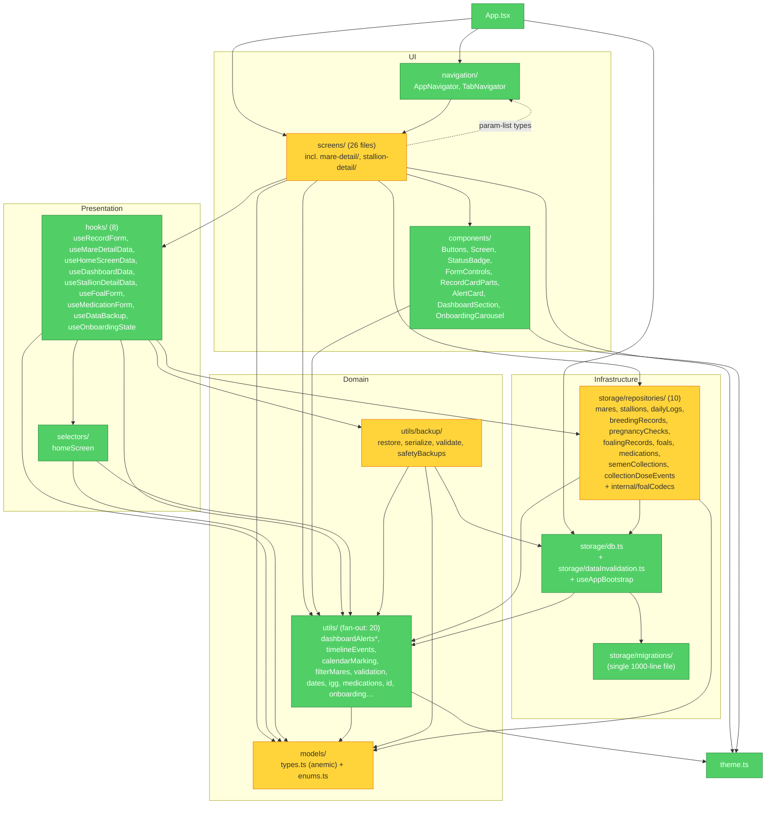

# Brooks-Lint Review

**Mode:** Architecture Audit
**Date:** 2026-04-23
**Scope:** entire project — `src/` (146 TypeScript/TSX files across 13 top-level subdirectories), plus `App.tsx`, navigation, and storage migrations
**Health Score:** 73 / 100
**Trend:** Prior audit at `ARCHITECTURE_AUDIT.md` reported 68/100 on 2026-04-22; the +5 delta reflects that several prior Critical items (e.g. dead parallel hook modules under `screens/*-form/`) have since been cleaned up and are no longer present in the tree.

Layering is clean and acyclic between storage/models/utils/selectors/hooks/components; the main architectural pressures are an anemic domain model, a `utils/backup/` leaf that reaches past the repository seam into raw SQLite, and a handful of oversized screen files that mix orchestration with rendering.

---

## Module Dependency Graph

Notes on the graph:
- Dotted arrow `Screens -.-> Navigation` = param-list types only; Screens import `RootStackParamList`/`TabParamList` while `AppNavigator` imports every screen. This is the conventional React Navigation pattern, so it is not flagged as a cycle finding.
- No other circular edges were detected at the module level.
- Repositories form a leaf-heavy internal graph (`foals → foalingRecords → breedingRecords → semenCollections → stallions`, and `pregnancyChecks → breedingRecords`) with no cycles.

---

## Findings

### 🟡 Warning

**Dependency Disorder — `utils/backup/` reaches past the repository seam**
Symptom: `src/utils/backup/restore.ts` and `src/utils/backup/serialize.ts` import `getDb` from `@/storage/db` and `emitDataInvalidation` from `@/storage/dataInvalidation`, bypassing the `@/storage/repositories` barrel that every other caller goes through. The module lives under `utils/`, which every other `utils/*` file treats as a leaf that depends only on `models/` and `theme`.
Source: Martin — Clean Architecture, *Stable Dependencies Principle*; Ousterhout — *A Philosophy of Software Design*, Ch. 5 *Information Hiding and Leakage*.
Consequence: Changes to the SQLite schema — column names, new tables, migration ordering — now have to be re-typed inside `utils/backup/*` in addition to the repositories. Any future swap of the storage engine breaks backup/restore independently of the rest of the app. The layer label "utils" also lies: this code is a feature (data export/import), not a utility.
Remedy: Move `utils/backup/` to `src/storage/backup/` (or `src/features/backup/`) and give it a repository-style interface (`exportSnapshot()`, `importSnapshot()`), so `hooks/useDataBackup.ts` only sees the feature API. Reading/writing raw rows can then use the existing repository functions for anything that has one, and a new `storage/backup/rawIO.ts` for schema-level work that genuinely must bypass repositories (restore into empty tables, safety snapshots).

**Domain Model Distortion — anemic models with domain logic scattered across `utils/`**
Symptom: `src/models/types.ts` exports `Mare`, `Stallion`, `Foal`, `BreedingRecord`, `PregnancyCheck`, `FoalingRecord`, `SemenCollection`, and `DailyLog` as plain data bags (every field is a primitive, union, or readonly array). Domain operations — `calculateDaysPostBreeding`, `estimateFoalingDate`, `findMostRecentOvulationDate`, `findCurrentPregnancyCheck`, `buildPregnancyInfoForCheck` — are free functions at the bottom of the same file; the rest of the domain logic lives in `src/utils/dashboardAlertRules.ts`, `utils/dashboardAlertContext.ts`, `utils/timelineEvents.ts`, `utils/calendarMarking.ts`, `utils/igg.ts`, `utils/foalMilestones.ts`, `utils/filterMares.ts`. `src/hooks/useMareDetailData.ts` reconstructs derived state (`pregnantInfo`, `breedingById`, `stallionNameById`) by plumbing the primitives back together.
Source: Evans — *Domain-Driven Design*, *Domain Model* pattern (the anti-pattern "Anemic Domain Model"); Fowler — *Refactoring*, *Data Class*; *Feature Envy*.
Consequence: New breeding rules require touching 2–3 `utils/*` modules plus a hook, rather than a single `Mare`/`BreedingRecord` abstraction. The domain boundary is invisible to readers — a new engineer cannot tell which util is "domain logic" versus "display formatter" versus "infrastructure helper" (e.g. `dates.ts` sits next to `dashboardAlertRules.ts`). The file `types.ts` also hides that it is the domain module; the name invites adding arbitrary shared types.
Remedy: Rename `src/models/` → `src/domain/`, split `types.ts` into per-aggregate files (`mare.ts`, `stallion.ts`, `foal.ts`, `breeding.ts`, `pregnancy.ts`, `foaling.ts`, `semenCollection.ts`), and co-locate the pure functions that operate on each aggregate with its type definitions. Pull `filterMares`, `timelineEvents`, `calendarMarking`, `foalMilestones`, `igg`, and `dashboardAlert*` out of `utils/` into `src/domain/<aggregate>/` where they belong. Keep `utils/` strictly for language-level helpers (dates, id, validation, scoreColors).

**Knowledge Duplication — `TAB_KEY_TO_INDEX` defined three times with overlapping shapes**
Symptom: `src/screens/MareDetailScreen.tsx:32`, `src/screens/StallionDetailScreen.tsx:27`, and `src/screens/mare-detail/MareDetailTabStrip.tsx:5` each declare their own `TAB_KEY_TO_INDEX`. The `MareDetailTabStrip` export has identical keys/values to the `MareDetailScreen` local copy, but `MareDetailScreen` imports only the component (line 17) and defines its own duplicate 15 lines later. The exported constant has no importers.
Source: Fowler — *Refactoring*, *Duplicate Code*; Hunt & Thomas — *The Pragmatic Programmer*, *DRY*.
Consequence: Adding a tab to Mare detail requires editing `MareDetailScreen.tsx`, `MareDetailTabStrip.tsx`, and the `initialTab` union in `RootStackParamList` — three places for one conceptual change. The dead export is also noise that suggests an incomplete refactor.
Remedy: Delete the duplicate in `MareDetailScreen.tsx` and import the exported map from `MareDetailTabStrip.tsx`. Give `StallionDetailScreen.tsx` a tiny sibling constant module (e.g. `src/screens/stallion-detail/tabIndex.ts`). Consider generating both from the `TAB_OPTIONS` tuple so the key list and order live in one place.

**Cognitive Overload — `BreedingRecordFormScreen.tsx` at 471 lines mixes loader + 3 method branches + soft-delete recovery**
Symptom: `src/screens/BreedingRecordFormScreen.tsx` holds 14 `useState` slots, four async effects, and branching validation for three AI sub-methods plus live cover, plus the "stallion not in list because soft-deleted — fetch and prepend" recovery path (lines 140–151). It imports 16 modules and calls 5 repository functions directly despite the project convention that screens delegate to hooks.
Source: Fowler — *Refactoring*, *Long Method*; Ousterhout — *A Philosophy of Software Design*, Ch. 4 *Modules Should Be Deep* (shallow-module symptom at the screen boundary).
Consequence: Any rule change (e.g. "frozen AI straw volume now required") forces the reader to hold all three method branches, the collection picker side effects, and the soft-deleted-stallion recovery in memory at once. The screen-vs-hook policy inconsistency also makes the file an outlier compared to `MareDetailScreen.tsx` and `DashboardScreen.tsx`, which delegate cleanly.
Remedy: Extract a `useBreedingRecordForm` hook that owns load/save/delete and the stallion+collection picker state (parallels `useFoalForm.ts` and `useMedicationForm.ts`). Split the three AI sub-sections into small components that take method-specific props. Move the soft-deleted-stallion merge into the stallion repository as `listStallionsIncluding(id)` so the screen no longer reasons about deletion state.

**Change Propagation — legacy `stallion_id` NULL + `stallion_name` dual identity**
Symptom: `BreedingRecord` carries both `stallionId: UUID | null` and `stallionName: string | null`. `listLegacyBreedingRecordsMatchingStallionName` exists in `src/storage/repositories/breedingRecords.ts:256` as a permanent fallback path. Every consumer that wants to display "which stallion?" has to check both fields (e.g. `MareDetailScreen`'s `stallionNameById` map does not cover legacy rows, and `BreedingRecordFormScreen.tsx:152–155` keeps a separate `useCustomStallion` branch).
Source: Hunt & Thomas — *The Pragmatic Programmer*, Ch. 2 *Orthogonality*; Ousterhout — Ch. 5 *Information Hiding and Leakage*; Fowler — *Shotgun Surgery*.
Consequence: The decision "what identifies a stallion on a breeding record?" is split across the schema, the repository, and every screen that renders a breeding. A future stallion-rename or stallion-merge feature has to be implemented twice — once against IDs and once against free-text names — and each new consumer silently re-introduces the coverage gap.
Remedy: Treat the legacy path as debt with a finite lifetime. Write a one-shot migration that creates a `Stallion` row per distinct `LOWER(stallion_name)` where `stallion_id IS NULL`, flips the FK, drops `stallion_name`, and deletes `listLegacyBreedingRecordsMatchingStallionName` + the custom-stallion branch in the form. If a soft-deleted Stallion must remain distinguishable, keep a `deleted_at`-aware getter instead of the dual field.

### 🟢 Suggestion

**Accidental Complexity — duplicate repository barrel `queries.ts` used only by one test file**
Symptom: `src/storage/repositories/queries.ts` re-exports 7 of the 10 repositories (missing `mares`, `semenCollections`, `collectionDoseEvents`). Its only importer is `src/storage/repositories/repositories.test.ts:32`. The real barrel is `index.ts` and is used by production callers.
Source: Fowler — *Refactoring*, *Lazy Class* / McConnell — *Code Complete*, Ch. 5 *YAGNI*.
Consequence: A reader sees two barrels and wonders which is authoritative; the narrower one silently drifts when new repos are added.
Remedy: Delete `queries.ts` and have the test import from `@/storage/repositories`, or document why tests need a narrower surface.

**Accidental Complexity — `utils/dashboardAlerts.ts` is a pass-through barrel**
Symptom: `src/utils/dashboardAlerts.ts` (40 lines) re-exports the eight threshold constants and four types from `dashboardAlertTypes.ts`, then wraps `buildDashboardAlertContext` + `generateAlertsForMare` into a 10-line `generateDashboardAlerts`. Consumers could import directly from the rule + context files.
Source: Fowler — *Refactoring*, *Middle Man*.
Consequence: Three files must be kept in sync when the alert input or constant list changes.
Remedy: Either collapse `dashboardAlertContext.ts` + `dashboardAlertRules.ts` + `dashboardAlertTypes.ts` + `dashboardAlerts.ts` into a single `src/domain/alerts/` module (see the Domain Model Distortion remedy), or narrow `dashboardAlerts.ts` to *only* the public `generateDashboardAlerts` entry and have consumers import types from `dashboardAlertTypes` directly.

**Cognitive Overload — `HomeScreen.tsx` (473 lines) and `DashboardScreen.tsx` (405 lines) mix orchestration and layout**
Symptom: `HomeScreen.tsx` mixes list rendering, search+filter state, pregnant-badge derivation display, dev-seed preview-build banner, and FAB wiring in one component. `DashboardScreen.tsx` inlines a `StatCard` subcomponent (lines 33–56) and hard-codes the kind→route mapping for seven alert types (lines 91–120).
Source: Fowler — *Refactoring*, *Long Method*; McConnell — Ch. 7 *High-Quality Routines*.
Consequence: Adding a seventh stat card or a new alert kind requires editing a 400-line file; the preview-build banner and the regular FAB live together and will eventually collide.
Remedy: Extract `StatCard`, the preview-build banner, and the alert-kind routing table into their own files. Each screen should end up closer to 150 lines of pure layout.

**Cognitive Overload — `src/storage/migrations/index.ts` at 1000 lines**
Symptom: A single 1000-line file holds every schema migration. Migrations are additive so the file can only grow.
Source: McConnell — *Code Complete*, Ch. 7 *High-Quality Routines*.
Consequence: Not painful today, but the file already dwarfs every other module in the repo; finding migration 003 requires scrolling.
Remedy: Split into `src/storage/migrations/001_initial.ts`, `002_*.ts`, … and have `index.ts` just export the ordered array. The migration runner already treats them as data.

---

## Testability Seam Assessment

- **Repositories** call `getDb()` directly — no interface injection. Tests run against a real SQLite (jest-expo setup). Acceptable for a single-DB offline-first app, but worth noting: swapping SQLite for another store (e.g. future Supabase sync) would require editing every repository module. No finding today.
- **Screens → hooks** is a clean seam. Screens can be tested by mocking the hook (pattern already used in `*.screen.test.tsx`).
- **`emitDataInvalidation`** is a module-level `Set<Listener>` singleton in `src/storage/dataInvalidation.ts`. Tests must be careful to reset it between runs; currently there is no `resetListeners()` helper. Suggestion-level risk.

## Conway's Law Check

BreedWise is a solo-developer project (single `Git user`, single working directory). Per the calibration examples in the audit guide, Conway's Law mismatch requires separate teams to be meaningful. Skipped.

---

## Summary

The top lever is consolidating the domain: rename `models/` → `domain/`, co-locate the pure functions that already exist as free functions, and pull `dashboardAlert*`, `timelineEvents`, `filterMares`, `calendarMarking`, `igg`, and `foalMilestones` out of `utils/` into the new domain module. That single move eliminates the anemic-model finding, shrinks `utils/` back to actual utilities, and clarifies where new breeding-domain logic should go. In parallel, relocate `utils/backup/` under `storage/` — it is a feature, not a utility, and it is the only cross-layer back-reference in the codebase. Everything else (TAB_KEY_TO_INDEX duplication, the 470-line form screen, the two dead/passthrough barrels) is cheap cleanup that falls out once the domain boundary is explicit. Overall architectural shape is sound and layering is acyclic; the audit is about clarifying names and ownership, not fixing structural breakage.
